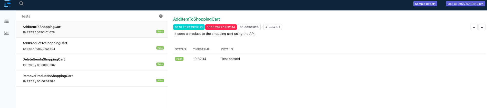

# DevExperts Demo assessment

A technical assessment for the **Software Engineer in Test** position.

## The project 💻

The following project was made using *Java*, *TestNG*, *RestAssured*, *Selenium* and *Extent Reports*. Review [here](/QE_test-task.pdf) the assessment proposed.
Review the test plan [here](./TestPlan.md)

## Tools ⚙️

* *IntelliJ IDEA 2022.2 (Community Edition)*.
* *Java v18.0.2.1*.
* _Maven v3.8.6_.
* _Lombok v1.18.24_.
* *TestNG v6.8*.
* *Selenium v3.141.59*.
* _WebDriverManager (BoniGarcía) v5.0.3_
* *RestAssured v5.2.0*.
* *ExtentReports v5.0.9*.
* _log4j v2.14.1_.
* *Postman v9.14.13* (for manual testing of the endpoints).

## Project structure 🗂️

```bash
.
├── .idea
├── extent-reports
├── log4j2
├── src/
│   ├── main/
│   │   └── java/
│   │       └── PageObjectModel/
│   │           ├── Components/
│   │           │   ├── Cart
│   │           │   ├── Home
│   │           │   └── Product
│   │           └── Pages
│   └── test/
│       ├── java/
│       │   ├── AutomationResources
│       │   ├── Data
│       │   ├── Models
│       │   ├── Tests
│       │   └── Utilities/
│       │       ├── ExtentReports
│       │       └── Listeners
│       └── resources
└── target
```

## Setup and Run 🛠️ ⚡️

I developed the code using a Mac, but it should work on a PC.

Look for the _pom.mxl_ file in the project (is located at root level). Do a right click over the file, 
and then click on **Download Sources and Documentation**. **_Maven_** is going to restore the
packages used in this project.

Finally, look for the _testng.xml_ file (_src => test => resources_), do a right click over the file,
and then click on **Run** option.

When you execute the tests, new folders (**extent-reports** and **log4j2**) and log files (_log4j2-sample-<date>.log_) are generated at the workspace root.
Inside of the **extent-reports** folder, you are going to see the report of the tests executed (you can open it
using your favorite browser). In the folder **log4j2**, you are going to see a new log file.


